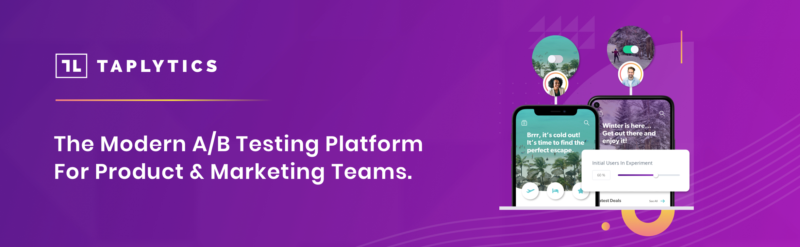

--- 

## Welcome to DevCycle!

Check out the following to get yourself up and running

* Read our [getting started documentation](https://docs.taplytics.com/)
* Select the [SDK of your choosing](https://docs.taplytics.com/docs/starting-with-taplytics)
* Head to our [Application Dashboard](https://taplytics.com/) 
* Read about our [REST API for management of your experiments and feature flags](https://docs.taplytics.com/reference/introduction) 
* Or directly use our [Universal API](https://universal-docs.taplytics.com/)

